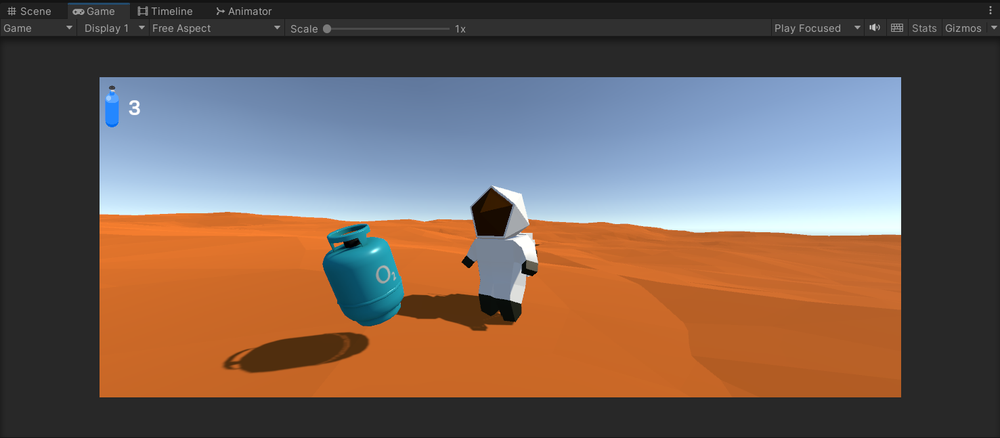

# Unity Martian Oxygen Quest 3D 👨‍🚀🪐

Embark on an interstellar adventure in **Unity Martian Oxygen Quest 3D**! Guide a brave astronaut through the challenging terrain of Mars as they collect essential oxygen tanks to survive. Developed using Unity and C#, this collectible game combines immersive gameplay with captivating visuals to deliver a unique gaming experience.

## 🌟 Project Overview

Created as part of a practical assignment in game development, this project showcases my skills in Unity by designing a 3D collectible game. The game features an astronaut navigating Mars, collecting oxygen tanks, and managing a real-time score displayed on an intuitive UI.

## 👽 Features

- **Collectible Gameplay**: Navigate Mars and collect scattered oxygen tanks to ensure survival.
- **Astronaut Avatar**: Use a dynamic astronaut model from the Unity Asset Store with various animations.
- **Real-Time Scoring**: Track your progress with a clear score display using TextMeshPro.
- **Immersive Environment**: Explore a detailed Martian landscape designed to challenge and engage players.

## 🛠️ Technologies Used

- **Unity 3D** for game development
- **C#** for scripting and game logic
- **TextMeshPro** for UI elements
- **Unity Asset Store** for assets

## 📦 Installation

1. **Clone the Repository**:
   ```bash
   git clone https://github.com/achraf-oujjir/Unity-Martian-Oxygen-Quest-3D-Game.git
   ```
2. **Open the Project in Unity**:
Ensure you have Unity installed (version 2021.x or later is recommended. This game has been developed on 2021.3.19f1). Open the project using Unity Hub or the Unity editor. Refer to this [article](https://support.unity.com/hc/en-us/articles/4402520287124-How-do-I-add-a-project-saved-on-my-computer-into-the-Unity-Hub).

## 🕹️ GamePlay

- **Objective**: Collect as many oxygen tanks as possible scattered across Mars to survive.
- **Controls**: Use standard controls for navigation and interaction with the astronaut avatar.
- **Score Tracking**: Monitor your score in real-time displayed at the top left of the screen.

## 🛠️ Implementation Details
### 🪐 Martian Environment

Imported from the Unity Asset Store, modified to resemble a Martian landscape with Martian soil and terrain. The package can be found [here](https://assetstore.unity.com/packages/3d/environments/landscapes/lowpoly-environment-pack-99479).

### 👨‍🚀 Astronaut Avatar

An astronaut model from the Unity Asset Store, complete with animations. Custom animations and scripts (e.g., Player.cs) were added to enhance realism.

### 💧 Oxygen Tanks

Imported from the Unity Asset Store as part of a package. The oxygen tank prefab allows multiple instances to be instantiated in the scene. Box Colliders are used for detecting collisions.

### 🎮 UI Elements

- **Score Display**: Uses TextMeshPro to show the number of collected oxygen tanks.
- **Oxygen Tank Icon**: An image representation of collected tanks on the canvas.

### 📜 Scripts

 - **OTank.cs**: The [OTank.cs](Assets/Scripts/OTank.cs) script manages the disappearance of oxygen tanks upon collision.
 - **PlayerInventory.cs**: This [script](Assets/Scripts/PlayerInventory.cs) increments the player's score for each collected oxygen tank.
 - **Player.cs**: This [script](Assets/Stylized%20Astronaut/Character/Player.cs) has been modified to configure animations.

## 📸 Media

<br>
<div align="center">
   
   <br><br>
   Preview of the Martian Land 
</div>
<br>

<br>
<div align="center">
   
   <br><br>
   Astro moves between the tanks
</div>
<br>

<br>
<div align="center">
   
   <br><br>
   Here are the animator conditions for Astro 
</div>
<br>
<div align="center">
   
   <br><br>
   This is the creation of the OTank Prefab
</div>
<br>
<br>
<div align="center">
   
   <br><br>
   This is the creation of the OTank Prefab
</div>
<br>

## 📚 References

- [Unity Asset Store Skybox](https://assetstore.unity.com)
- [LowPoly Env Package Used in the Project](https://assetstore.unity.com/packages/3d/environments/landscapes/lowpoly-environment-pack-99479)
- [Free Tools Kit Used in the Project](https://assetstore.unity.com/packages/3d/props/tools/free-tools-kit-155875)

## 📝 License

This project is licensed under the MIT License. See the LICENSE file for more details.
